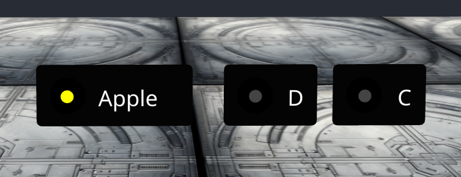

# Documentation: Using the `a-radio-component` in A-Frame

The `a-radio-component` is a custom A-Frame component designed for creating interactive radio button groups in virtual reality environments. It allows users to select a single option from a set of choices. This document provides a comprehensive guide on how to use the `a-radio-component`.

## Overview

The `a-radio-component` is built with A-Frame, a web framework for building virtual reality experiences. It utilizes custom elements to create a radio button group, where each radio button can be interacted with using VR controllers or standard mouse input in a browser. The component supports customization options such as setting the initial selected value and dynamically updating the choices available.



## How to Use

### Prerequisites

Ensure you have A-Frame included in your project. You can include it directly from a CDN in your HTML file:

```html
<script src="https://aframe.io/releases/1.5.0/aframe.min.js"></script>
```

### Step 1: Import the Component

First, import the `a-radio-component` into your project. Place the JavaScript file that contains the component's code in your project and include it in your HTML file or import it into your JavaScript module.

```javascript
import gui from "./gui";
import { load } from 'a-frame-components';

export default function SpaceShipScene() {
    const [loaded, setLoaded] = useState(false);
    useEffect(() => {
        load().then(() => {
            gui();
            setLoaded(true);
        });
    }, [])
    if (!loaded) {
        return <></>
    }
    return (
        <a-scene>
            <a-radio-component options={JSON.stringify([{
                text: 'Apple',
                value: 'A',
                id: 'A',
                width: .5
            }, {
                text: 'D',
                value: 'D',
                id: 'D'
            }, {
                text: 'C',
                value: 'C',
                id: 'C'
            }])} value={'A'}></a-radio-component>
        </a-scene>
    )
}
```

### Step 2: Add the Component to Your Scene

To use the `a-radio-component`, add an `<a-entity>` element to your A-Frame scene and specify the `a-radio-component` as a child of this entity. Use the `options` attribute to define the radio button options and the `value` attribute to set the initially selected option.

```html
<a-entity position="0 1 0">
    <a-radio-component options='[{"text": "Apple", "value": "A", "id": "A", "width": 0.5}, {"text": "Banana", "value": "B", "id": "B"}, {"text": "Cherry", "value": "C", "id": "C"}]' value="A"></a-radio-component>
</a-entity>
```

### Options Attribute

The `options` attribute takes a JSON string representing an array of objects, where each object defines a radio option with the following properties:

- `text`: The label text displayed next to the radio button.
- `value`: The unique value associated with the option.
- `id`: A unique identifier for the option.
- `width` (optional): The width of the button. If not specified, a default value is used.

### Value Attribute

The `value` attribute specifies the initially selected option based on its `value` property. It should match one of the values provided in the `options` array.

### Interactivity

Users can select an option by clicking on it. The component emits a `click` event with the selected option's value, allowing you to handle user selections and integrate them into your application logic.

### Customization and Styling

You can further customize the appearance and behavior of the radio buttons by modifying the component's code. This includes changing the colors, sizes, and positioning of the buttons.

### Step 3: Listening for Changes

To react to user selections, listen for the `click` event on the `a-radio-component`. This event provides the selected option's value, which you can use to update your application state or trigger other actions.

```javascript
document.querySelector('a-radio-component').addEventListener('click', function(event) {
    console.log('Selected value:', event.detail.value);
});
```

## Example

Here is a complete example of including the `a-radio-component` in an A-Frame scene:

```html
<!DOCTYPE html>
<html>
<head>
    <script src="https://aframe.io/releases/1.2.0/aframe.min.js"></script>
    <script src="./path/to/a-radio-component.js"></script>
</head>
<body>
    <a-scene>
        <a-entity position="0 1 -3">
            <a-radio-component options='[{"text": "Apple", "value": "A", "id": "A", "width": 0.5}, {"text": "Banana", "value": "B", "id": "B"}, {"text": "Cherry", "value": "C", "id": "C"}]' value="A"></a-radio-component>
        </a-entity>
    </a-scene>
</body>
</html>
```

In this example, the radio component is positioned in front of the camera, and users can select between "Apple", "Banana", and "Cherry" options. The "Apple" option is selected by default.

## Conclusion

The `a-radio-component` is a powerful tool for adding interactive radio button groups to your A-Frame VR experiences. By following the steps outlined in this document, you can incorporate customizable radio buttons into your scenes, enhancing

 the interactivity and usability of your VR applications.